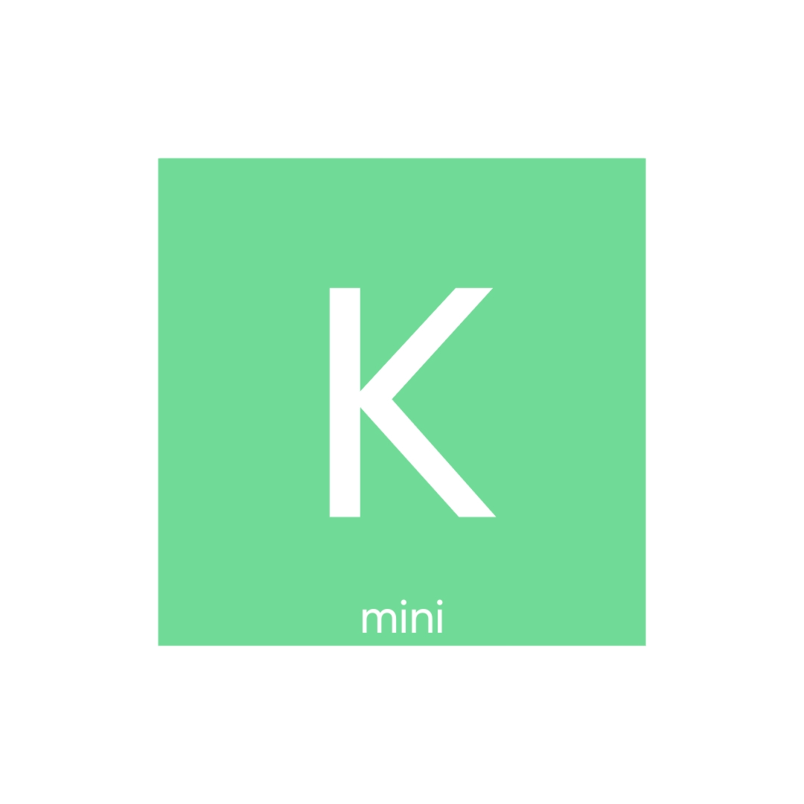

<h1>
KerAss-mini
</h1>

If KerAss is not "mini" enough

Bare minimum Deep Learning Framework for dummies.
 

---

Provides: 
1) Tiny Keras-like API 
2) Simple Python Code 
3) NumPy Basis 
4) Documentation (maybe) 
5) Optimization (not bloated with complex architectures)

---

Why? 
I need it as a basis for KerAss and a place where I can build core architecture. 
This framework contains only core layers and model types. 
More complex API will be available at Venchislaw/KerAss. 
I've already worked on the <a href="https://github.com/Venchislaw/lunar_max">LUNA-R</a> project (check it out) that was inspired by SciKit-learn. 

---

MIT License 
Google and François Chollet, it's just a joke. 
Please don't break my legs somewhere in an alley. 
Hire me instead ;3

---

 
mini ass

